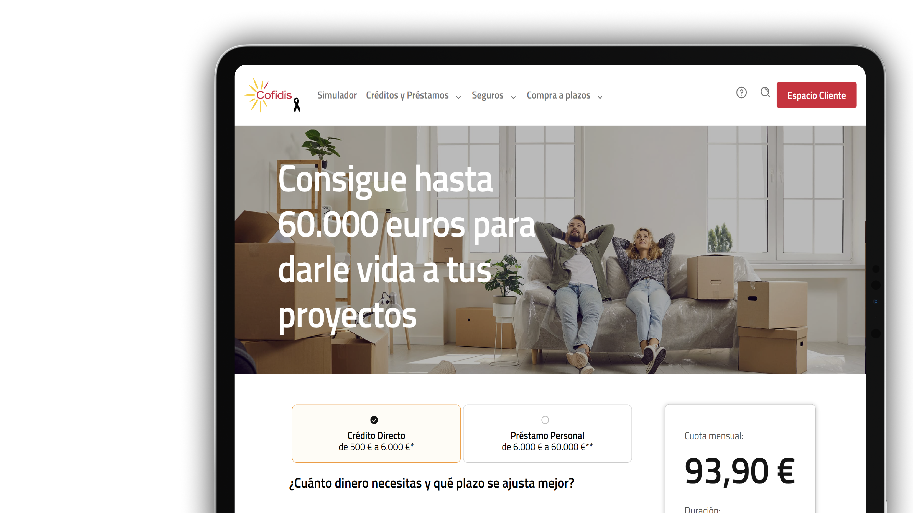

# Cofidis new website

Role: UX / UI Designer
Team: Collaboration with design, development teams, and stakeholders
Tags: Redesign, UI/UX, Website
Tools: Figma, Jira, Teams, UserZoom

# Project overview

I was part of the team responsible for the full redesign of Cofidis' website.

My role included conducting an in-depth **benchmark** of landing pages, designing **key components**, and contributing to the creation of a unified **design system**.

I also worked closely with **cross-functional teams** to prioritize features and ensure that design decisions aligned both with user needs and business goals.

# **Confidentiality agreement**

Due to a signed NDA, I am unable to share specific details about the research process or deliverables. However, you can **explore the final result** on their official website:

👉[Visit Cofidis' website](https://www.cofidis.es/)