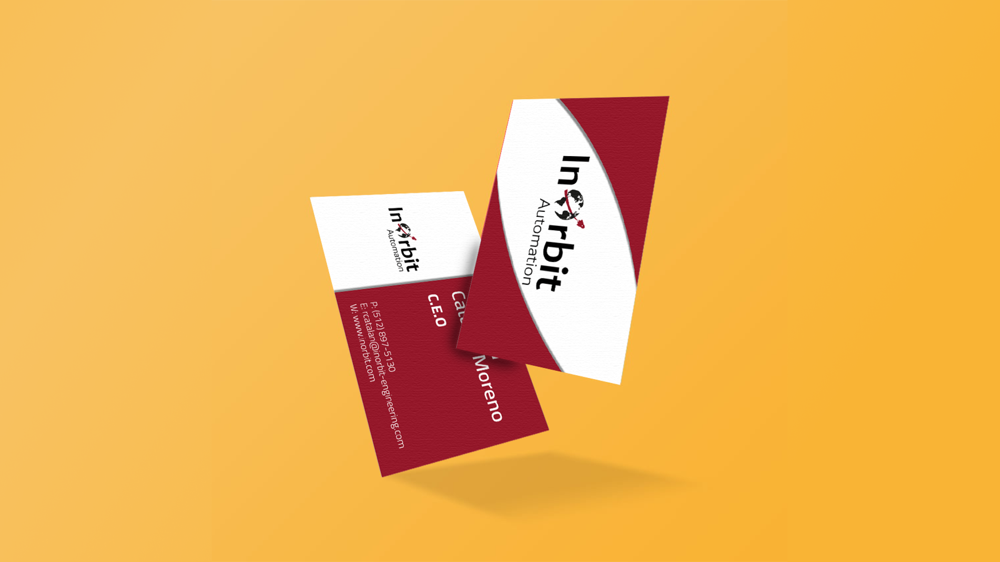

# Designs

Role: Designer
Tags: Graphic design
Tools: Illustrator, InDesign, Photoshop

---

# InOrbit engineering

This project showcases the **visual identity creation for InOrbit**, an engineering company dedicated to excellence and innovation.

The logo and business card design blend space-inspired elements to represent **exploration and progress**, capturing InOrbit's innovative and bold spirit.

A maroon and black color scheme brings **elegance and energy** to the visual identity, embodying the brand's passion and commitment.

# November project

"November project" is a free, public workout group that originated in Boston, Massachusetts, in 2011. Each year, the group holds a **contest to design their seasonal buff**—a versatile piece of headwear that members wear during workouts. 

The contest welcomes participants worldwide and accepts various creative approaches. To maintain reasonable production costs, designs must use only two colors (excluding white).

# DomusBee

During my time at the [DomusVi Foundation](https://fundaciondomusvi.org/), I led several socially responsible and innovative projects. A notable highlight was "DomusBee," for which I designed the logo. 

The design cleverly **merges the company's name with "bee,"** serving not only as a creative project but also as a meaningful initiative to promote environmental awareness.

# Bottle

Inspired by a diver's passion, I created a **custom reusable bottle design** commemorating Laura's adventures in Indonesia's underwater worlds. 

The design incorporates **marine elements and ethnic motifs** to capture the exotic spirit of her journey. I personalized it further by incorporating her name into the artwork.