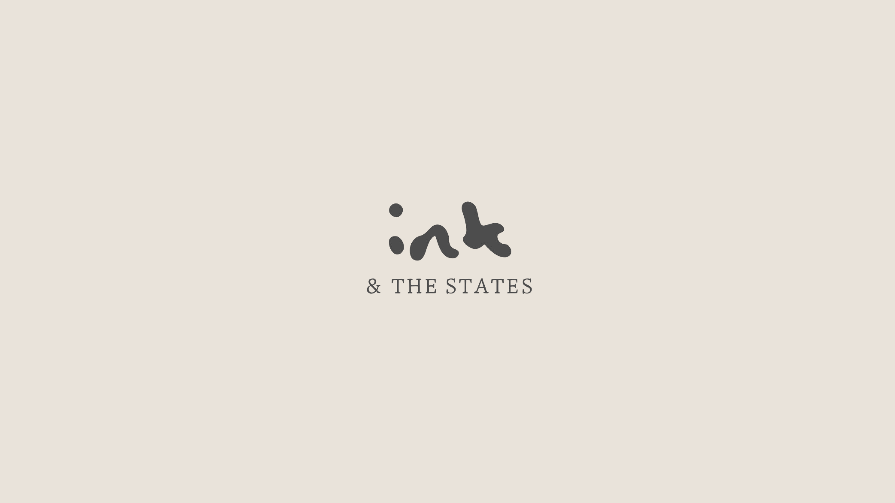
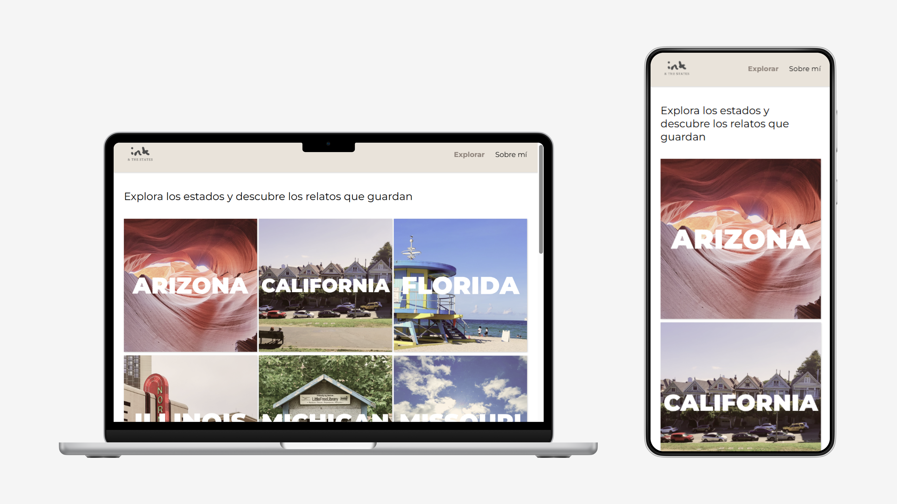
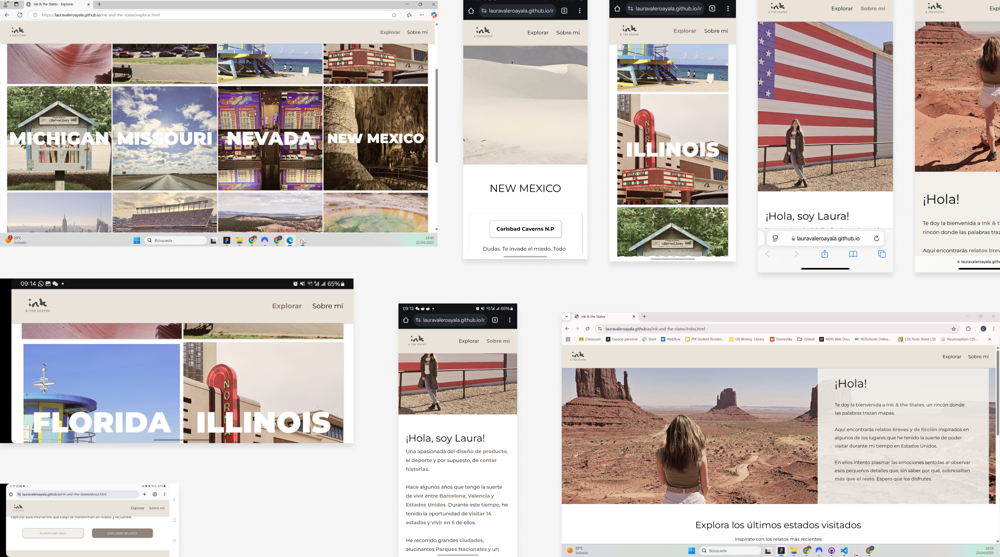
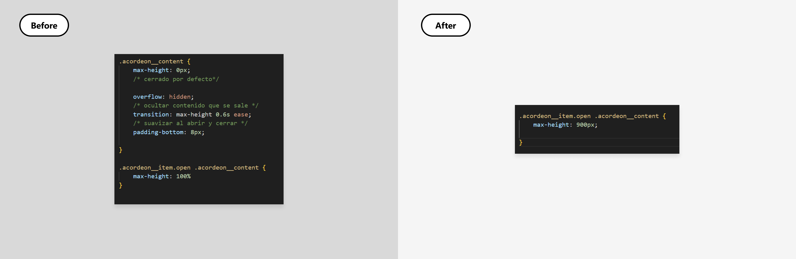
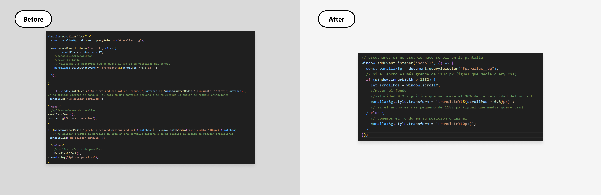
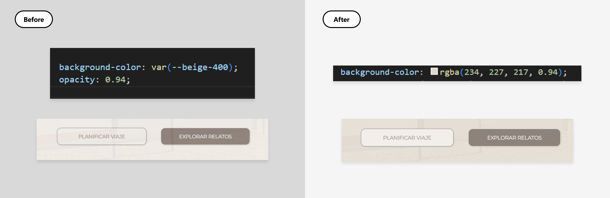
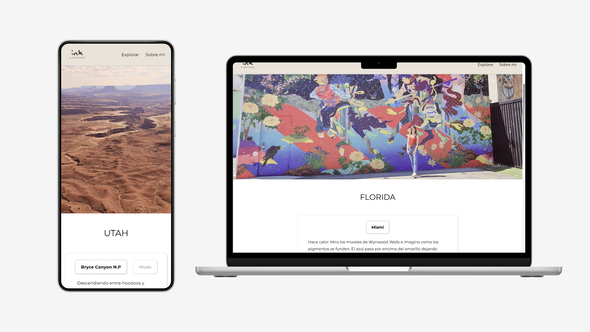

# Ink & the States

Role: Web designer
Team: Just me
Tags: CSS, HTML, JAVASCRIPT, Web design
Tools: Figjam, Figma, GitHub, Visual Studio Code



# A quick look

Four years ago, after my partner accepted a job abroad, I started living between Spain and the United States.

This change has allowed me to discover incredible places that, in one way or another, have inspired me. I’ve always loved writing, so in 2021, I started publishing stories on my blog [*El món amagat*](https://elmonamagat.blogspot.com/) — texts inspired by the landscapes, experiences, and emotions of my travels.

[*Ink & the States*](https://lauravaleroayala.github.io/ink-and-the-states/index.html) is an evolution of that blog. With this website, I aim **to offer a more refined and visually engaging reading experience**, allowing readers to explore places through words.


# Tools

The project was developed using **HTML, CSS, and JavaScript**. The wireframes and screen designs were created in **Figma**, where I also edited images to ensure visual consistency with the overall style of the site.

For planning and tracking the progress of the different project phases, I used **FigJam**. The main code editor was **Visual Studio Code**, and the code was stored in a [**GitHub** repository](https://github.com/lauravaleroayala/ink-and-the-states).


# Colors & Typography

The design of *Ink & the States* is minimal and uses an **earthy color palette** to reflect the natural landscapes described in the stories.

The chosen font is **Montserrat**, a sans serif typeface that ensures a pleasant reading experience on both large screens and mobile devices.

To maintain visual consistency across the site, I defined **CSS variables** using these values. I also applied a spacing system based on multiples of **4px** to create a clean and balanced layout.


# Testing & Validation

### **Making sure Ink & the States runs smoothly**

To ensure proper display on any device, I developed the layout with a **mobile-first** approach and used the following CSS tools:

- **Flexbox**
- **Grid**
- **Media queries**
    
    
    

### **Testing on real devices**

In addition to using the **ResponsivelyApp** to test the website, I verified that all layouts adapt well to different **screen sizes**, **browsers**, and **operating systems**.



When validating the HTML with the **W3C plugin**, several errors were detected due to the use of `<button>` elements inside `<a>` tags, which is not allowed.

To fix this, I removed the `<button>` tags and applied the `.button` class directly to the `<a>` elements, keeping the same style and functionality. Additionally, two warnings were resolved by specifying the document language as Spanish and replacing `<section>` tags with `<div>` elements when they were not semantically necessary.

For the CSS, I used both the **W3C CSS validator** and **projectwallace.com**. The code scored over **95%** in maintainability, complexity, and performance. The specificity graphs showed mostly flat curves, indicating a clean and well-structured stylesheet.

**Lighthouse** tests returned scores above **90%** in all categories across the different pages, except on the **“***Explore***”** page, where performance dropped to 65%. This suggests that while the overall site is well optimized, this specific page could benefit from improvements in **image loading speed**.

A **contrast test**, performed with the **Figma Contrast** plugin, showed positive results for most elements, except for the button text, which didn’t meet the recommended accessibility contrast minimum. As a temporary fix, I increased the **font weight on hover** to improve visibility. However, this will need to be addressed more thoroughly in future design iterations.

Lastly, using **yellowlab.tools**, the project received an overall score of **A**.

In future iterations, I plan to collect user feedback to continue improving the usability and overall experience of the site.

**Screenshots** of all test results can be viewed [here](https://www.figma.com/board/v9F1M7YiDl2tDHnanYiTts/Proyecto-final?node-id=0-1&t=yC2RoXPmsd56jrMM-1).

# **Challenges Encountered**

### Accordion transition not working smoothly

The transition effect for opening and closing the accordion wasn’t working as expected.

**Solution**

Since

```
max-height: 100%
```

doesn't allow the browser to calculate the actual height during the animation, I replaced it with a fixed

```
px
```

value large enough to fit the content of the longest item (Arizona).



### **Parallax effect on hero image not behaving correctly on small screens**

With the initial code, the parallax effect on the home hero image was still applied on small screens, unless the page was reloaded.

**Solution**

I learned to use

```
window.innerWidth
```

to detect screen size with JavaScript and adapted the code so it would always respond correctly to the current screen size.



### **Buttons in the “About Me” section appeared transparent**

Even after setting

```
opacity: 1
```

the buttons inherited the transparency from their parent container.

**Solution**

Instead of using the opacity property on the color variable, I applied the equivalent **beige** background color using **RGBA**, preventing the opacity from affecting child elements.



# Links

**GitHub Repository**

[https://github.com/lauravaleroayala/ink-and-the-states](https://github.com/lauravaleroayala/ink-and-the-states)

**Main URL**

[https://lauravaleroayala.github.io/ink-and-the-states/index.html](https://lauravaleroayala.github.io/ink-and-the-states/index.html)



# Final thoughts

This new version, [*Ink & the States*](https://lauravaleroayala.github.io/ink-and-the-states/index.html), refines the reading experience of [my first blog](https://elmonamagat.blogspot.com/) through a minimalist aesthetic and a clearer, more coherent organization of information.

Although some technical challenges arose during development, I believe the project successfully meets its goals.

This is just a solid foundation on which I can continue to iterate and add new features in the future — a starting point to keep growing and improving in this field.