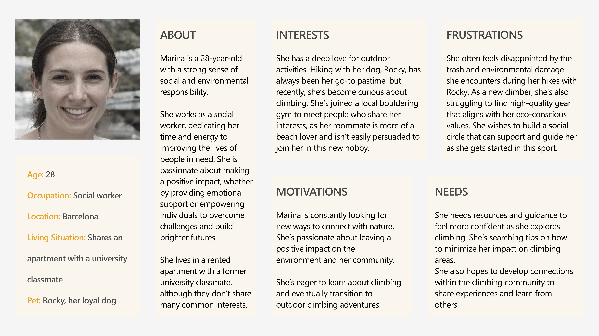
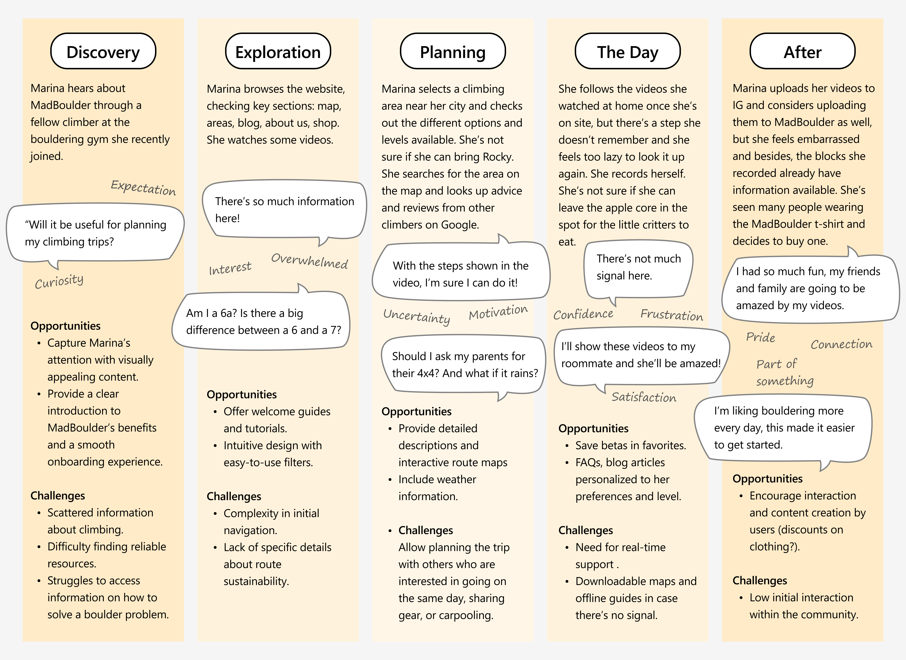
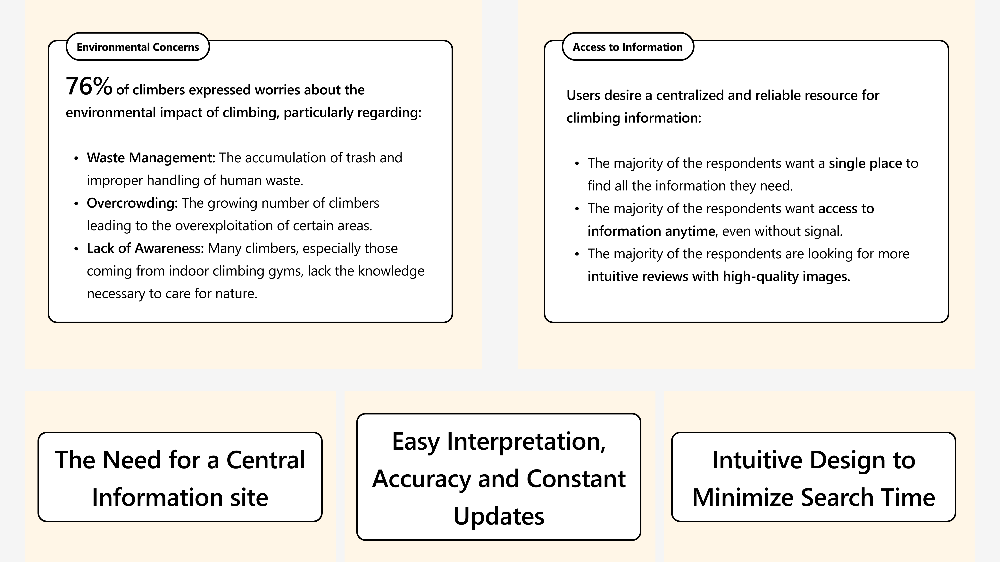
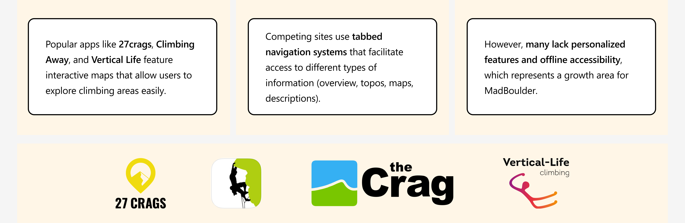
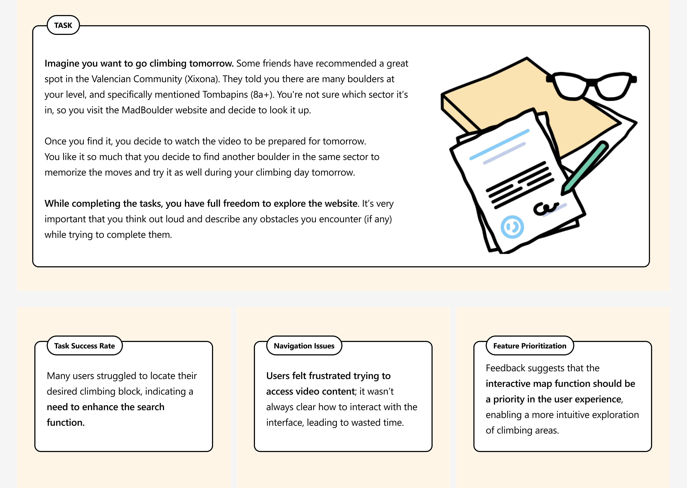
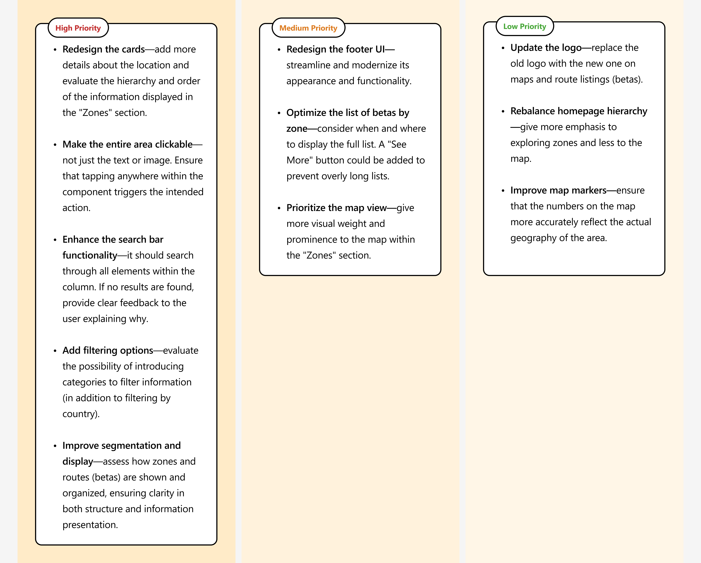
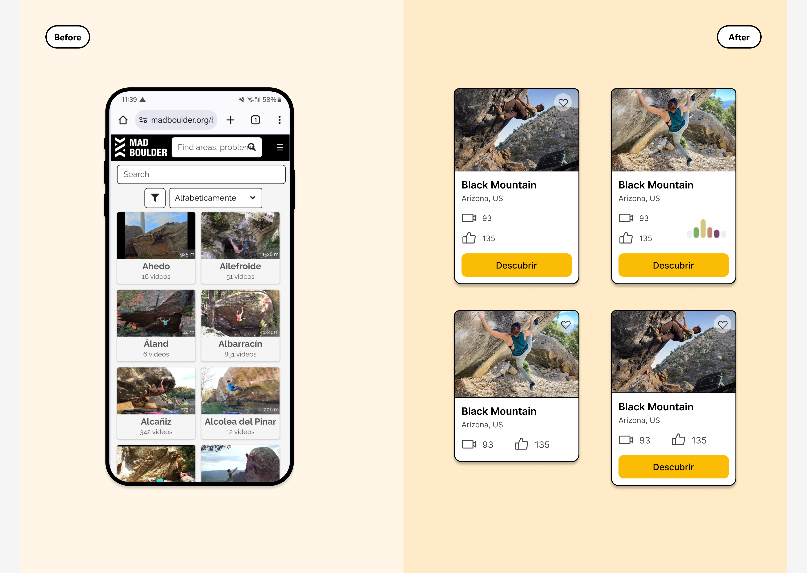
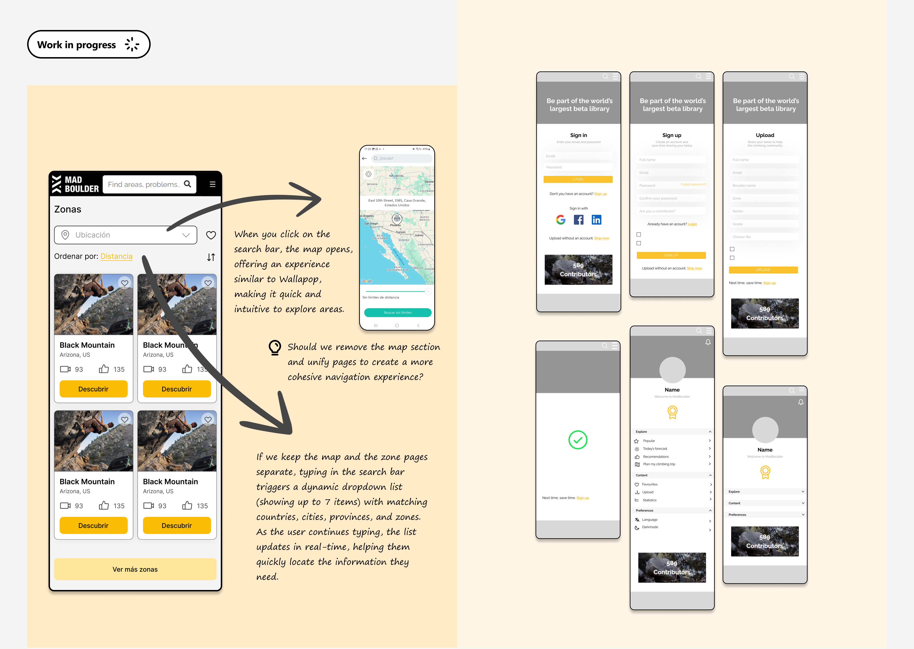

# MadBoulder

Role: UX / UI Designer
Team: Collaboration with product, community, and development teams
Tags: Redesign, UI/UX, Website
Tools: Figma, Google Forms, Google Meet, Miro, Slack

---

# Project overview

The goal of this project is to make outdoor climbing accessible for everyone. As a nature and climbing enthusiasts, we understand how important it is to have high-quality information available for the climbing community. Through comprehensive UX research, we aim to **enhance the user experience on the [MadBoulder](http://www.madboulder.org) platform.**

# **Getting to know our climbers**

The first step was understanding who we were designing for. We conducted in-depth research through **surveys, empathy maps, and interviews** to identify key user needs and pain points.
One **persona** appeared—Marina, who loves spending time outdoors and discovering new adventures but often feels overwhelmed by environmental damage and unsure about how to start her climbing journey.

# **The discovery phase**

With Marina in mind, we went further into the research.

**Surveys** revealed that **76%** of climbers shared Marina’s environmental concerns. Issues like waste accumulation, overcrowding, and lack of awareness about responsible climbing practices topped the list.

**Competitive benchmarking** gave us insights into what competitors were doing well—interactive maps and tabbed navigation—but also where they fell short, especially in offline accessibility and personalization.

**Usability tests** highlighted pain points in MadBoulder’s current platform. Users struggled with the search function, unclear navigation, and difficulty accessing videos. These issues often led to frustration and early drop-offs.

# **Prioritizing the Problems**

Guided with insights, it was time to act. We **categorized findings and prioritized the most urgent issues**.

Focusing first on the cards, we worked to improve their visual hierarchy and make them more intuitive.

With the new cards we are looking for a **higher task success rate** and **reduced frustration** when navigating the platform. These initial wins reinforced the importance of listening to users and prioritizing their needs.

With four final design proposals ready, the next step is to **test their performance** and gather user feedback to determine which version delivers the best results.

We plan to conduct **A/B testing** to compare the effectiveness of each design in real scenarios. Participants will be asked to complete specific tasks, such as finding a climbing area or accessing video content, to measure **task completion rates, time on task, and user satisfaction**.

Additionally, we will use **usability testing sessions** to observe user behavior and identify any areas for improvement. Feedback collected during these sessions will help refine the final design, ensuring it meets user needs and expectations.

Looking ahead, the next steps involve:

- Optimizing the search function to make route-finding easier.
- Introducing profile customization for personalized recommendations.
    
    
    

# Continuous improvement

The MadBoulder project is still in progress, with continuous updates and improvements based on user feedback. 

Our main goal is to make climbing information more accessible, reliable, and easy to use for everyone. We’re constantly working to improve the platform and make sure it meets the needs of climbers, like Marina, with a user-friendly experience.

Good UX/UI design is a process of continuous iteration. By using user testing, feedback, and data analysis, we are always refining the platform to make it better. This process is key to creating a successful product. In the future, we will focus on improving features like offline access, easier navigation, and personalized recommendations to make MadBoulder the top choice for climbers and encourage responsible, sustainable climbing.