# Voice

Role: UX / UI Designer
Team: I was responsible for the entire process from research to prototyping
Tags: Case Study, Mobile App, UI/UX
Tools: Excel, Figma, Google Forms

---

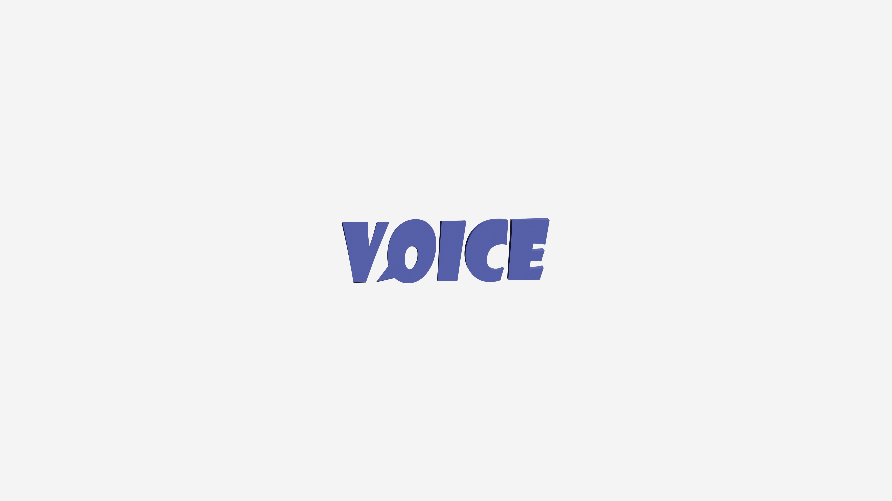

# A quick look

Voice creates a safe and welcoming environment through its simple, accessible interface where language learners can practice speaking. Users can engage in conversations whenever and wherever they want, while bringing purpose and dignity to an often-overlooked group—seniors living in care facilities. By connecting these groups and establishing seniors as mentors, Voice promotes active aging and empowers older adults to contribute meaningfully to digital initiatives, creating value for everyone involved.

# Problem

Research shows that **speaking is the biggest challenge for 43.5% of language learners**, with listening comprehension following at 30.4%. While **69.6% find it difficult to connect with native speakers** for practice, most learners feel comfortable conversing with seniors—who often have both time and enthusiasm for meaningful conversations.

Meanwhile, **seniors frequently experience isolation** due to a lack of meaningful interactions. Studies indicate that both the frequency and depth of social connections play a crucial role in their sense of happiness and social connection.

# Solution

Voice improves the quality of life for two user groups:

- Seniors living in care homes
- People learning a new language

Voice aims to **reduce seniors' loneliness** by up to 30% through active engagement and meaningful relationships. For language learners, the app projects a 20% **improvement in fluency** after three months of regular conversation practice.

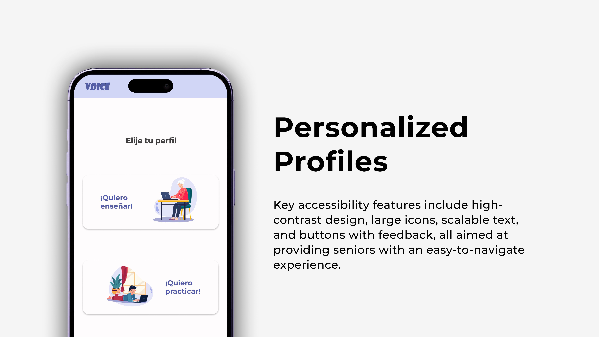

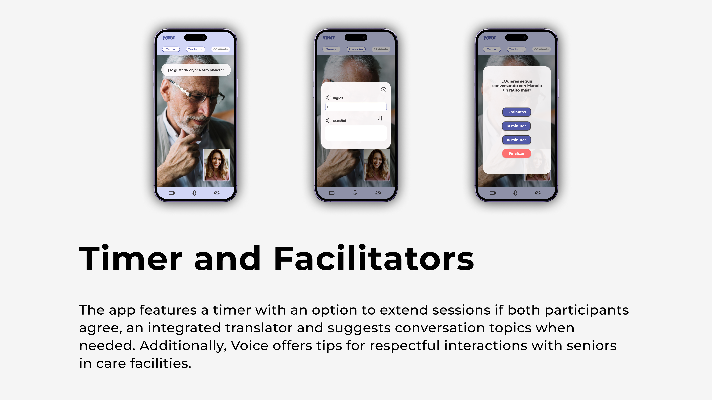

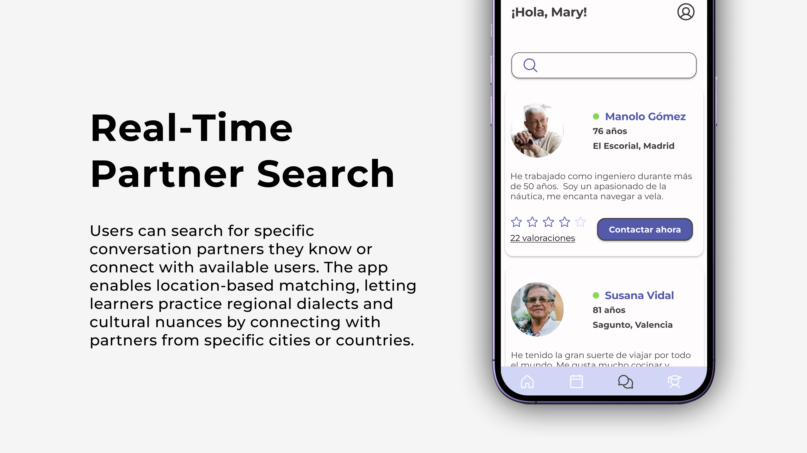

<aside>
☝

This user-centered approach bridges generations while creating valuable interactions that enhance both learning outcomes and emotional wellness.

</aside>

---

# Process

Through a user-centered approach and the Double Diamond framework, I developed features tailored to the needs of both language learners and seniors.

<aside>
👉

Click to jump to the corresponding section

</aside>

[User Research →](https://app.notion.com/p/Voice-159bd7a9feb880709f1ce9ba72af0f51?pvs=21) 

[Beyond the Data →](https://app.notion.com/p/Voice-159bd7a9feb880709f1ce9ba72af0f51?pvs=21)

[Let’s Design →](https://app.notion.com/p/Voice-159bd7a9feb880709f1ce9ba72af0f51?pvs=21)

## User research

To start the design process, I focused on understanding our users deeply. I developed **User Personas** and **Empathy Maps** for each profile to capture what drives them, what they need, how they feel, and how they act. This groundwork helped me make design choices that directly address our users' specific challenges and aspirations.

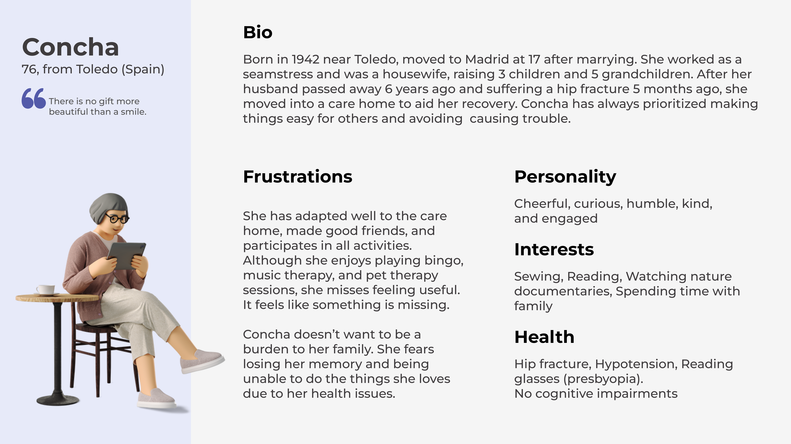

- **What does Concha feel?** 💜
    - Although the care in the residence is good, she misses being in her own home
    - As you get older, people tend to undervalue you and treat you like a child
    - Despite her injury, she still feels very capable

- **What does Concha see?** 👀
    - In the nursing home, there are people in much worse mental states; fortunately, she hasn’t lost her mind
    - The professionals greatly value her cooperative attitude
- **What does Concha say and do?** 🗨️
    - Although this situation isn’t her favorite, in the end, it’s just part of life
    - She focuses on her hip rehabilitation
    - She takes part in all the offered activities to exercise her memory, feel connected, and avoid overthinking
- **What does Concha hear?** 👂
    - She is always invited to participate in all the projects and activities at the nursing home
    - Her family tells her they think she has adapted very well

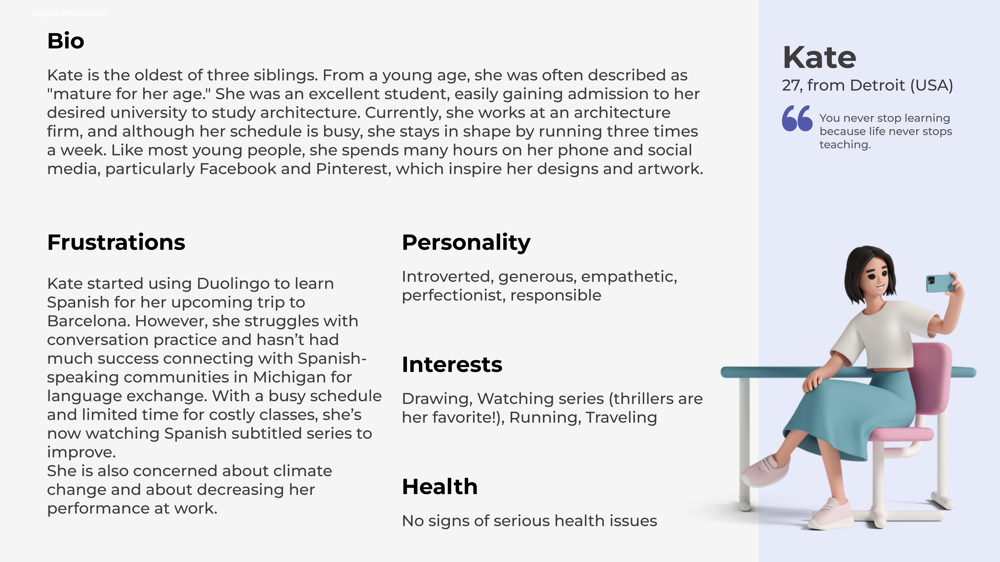

- **What does Kate feel?** 💜
    - She greatly enjoys the process of learning new things
    - She feels that there aren’t enough resources that adapt to her pace and needs
    - Due to her introversion, she often prefers activities with fewer people
- **What does Kate see?** 👀
    - She lacks the time to do everything she wants
    - Language academies are very expensive, and their methods are overly structured
    - The cold in Michigan makes it difficult; often, roads are blocked by snow, preventing her from attending classes
    - She’s comfortable with grammar
- **What does Kate say and do?** 🗨️
    - She looks for native speakers on social media to propose a language exchange
    - She asks at public libraries if there are conversation groups
    - She searches online for free learning resources
    - She starts using apps like Duolingo
- **What does Kate hear?** 👂
    - She never tires of studying
    - After work, she still has the energy to keep learning
    - She acknowledges that modern translation apps can be very helpful for communication during her trip

Next, I developed a **Userjourney** to visualize how both user groups experience the app—before, during, and after using it. This mapping helped identify **key touchpoints, pain points, and opportunities** to enhance the overall user experience.

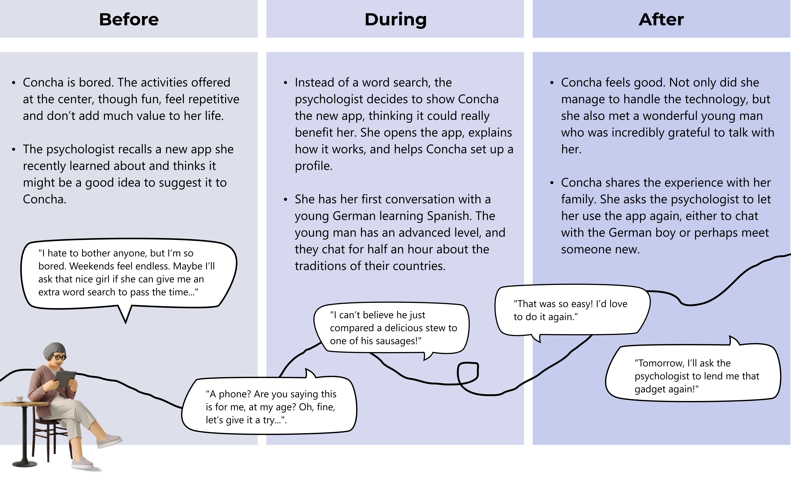

- **Insights**
    - Implement a strong communication strategy to ensure that staff in senior residences are informed about the APP
    - Registration form detailing interests and availability
    - APP designed for seniors: highly intuitive, with large, high-contrast text and icons, and a screen reader option
    - Steps must be simple and clear. Include a well-structured onboarding process or a section with usage tutorials
    - Option to suggest conversation topics in case users run out of ideas
    - Could include a section for rating exchanges and adding people to favorites

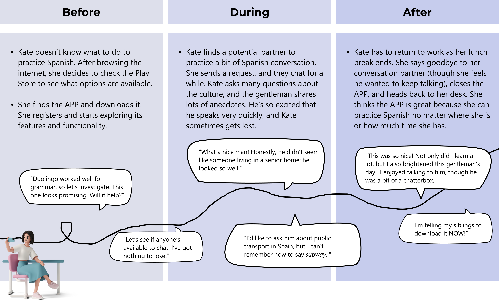

- **Insights**
    - Onboarding, an easy and quick registration form, profile customization with personal information, levels, interests, and languages
    - The option to request a conversation with anyone currently online (or manually search for someone you already know). Both parties must accept
    - Guidelines on interacting with institutionalized seniors/ myths and truths about nursing homes
    - A built-in translator to look up words quickly without interrupting the conversation
    - The ability to provide feedback or create a brief summary of the conversation to revisit it later
    - A timer to track the conversation duration, with the option to add more time if both parties agree
    - The ability to schedule future meetings
    - A community feature to share experiences and the option to share on social media or through WhatsApp
    

- Through an **interview** with Gemma, a psychologist at the Santa Teresa senior center (Valls), I gathered these **key findings**
    - In nursing homes, there is an increasing **focus on person-centered care**, creating spaces where individuals can pursue their personal projects.
    - We live in a society that **often undervalues and underestimates older adults**, even though they are an incredible source of wisdom and knowledge.
    - Voice could help seniors feel useful, **boosting their self-esteem**. Being part of such a project could foster a sense of belonging, **reduce feelings of loneliness, and encourage new interpersonal connections**. It would also provide **cognitive stimulation**, both through interaction with others and the challenge of learning to use new technology.
    - Voice would be designed for individuals with mild cognitive decline or no cognitive impairment, paired with physical or visual disabilities. It would also cater to users with no or very mild cognitive decline who are familiar with or capable of learning new technologies.
    - The APP could **foster emotional connections** and bonds between participants.
    - As with any interaction, mismatched pairs might occasionally occur. To address this, there could be a **rating system** or a button to flag discomfort or indicate a preference not to speak with a specific person.
    - A **user guide** would also be beneficial to ensure accessibility and ease of use.

## **Beyond the Data**

Based on all the findings and insights, I created a **Needs Matrix** to guide the creation of user-centered design solutions.

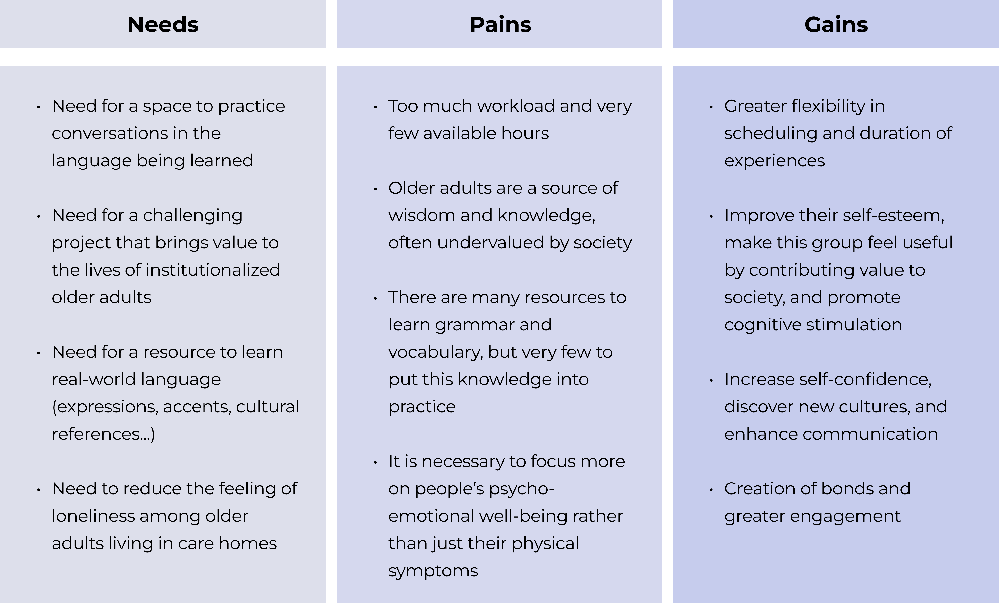

.png)

With the **value proposition**, I answered the *why*:

Why does this solution matter? What problem does it solve? Why would users choose this solution over others? It identifies the core benefits **Voice** offers and how it uniquely addresses user needs.

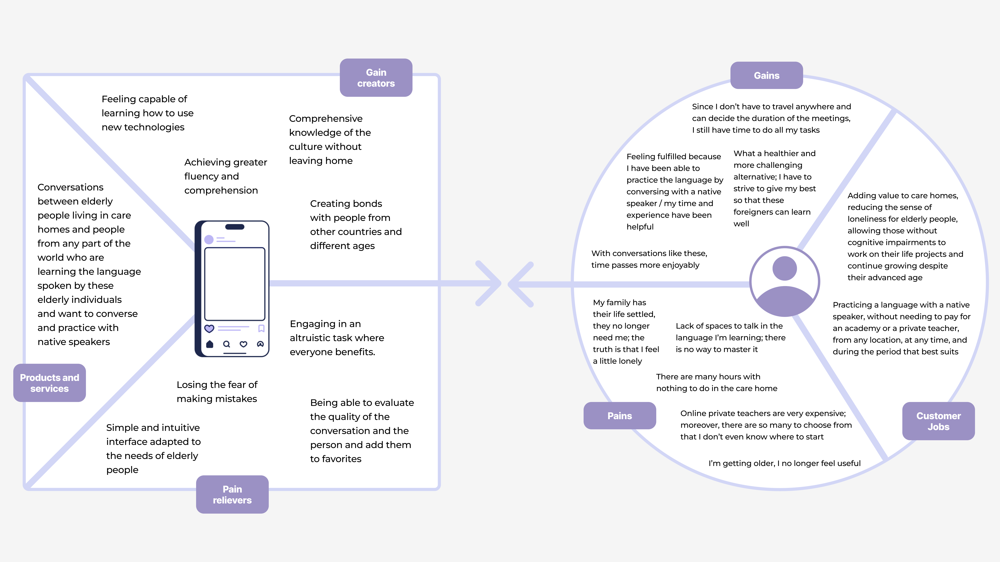

On the other hand, with the **business model canvas**, I explored the *how*:

How will this solution be implemented? This tool provides a clear, strategic overview of essential elements such as target audiences, communication channels, key partners, resources, revenue streams, and cost structure.

.png)

These tools work together to transform an idea into a viable, sustainable, and user-centered solution.

## Let’s design!

What Will Voice's UI Look Like? 

First **wireframes**.

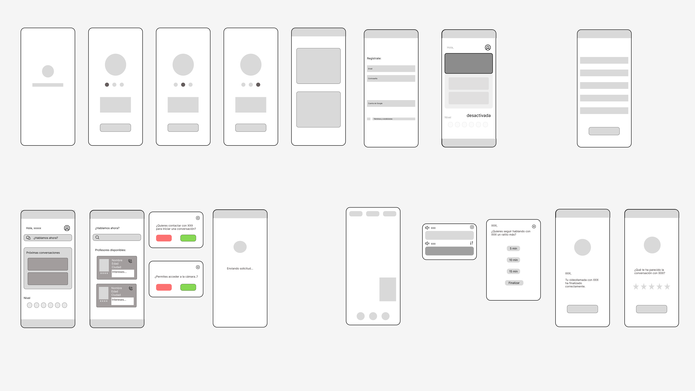

**User flow** Based on Interaction with Home and "Start Conversation" from the Student Profile.

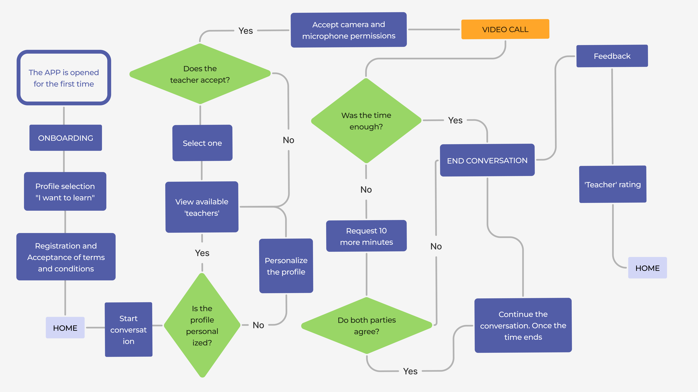

Key interface considerations for the **final screens**

- Bright and high-contrast visuals
- Large, well-defined icons with clear outlines
- Adjustable font sizes
- Minimal and easy-to-memorize options

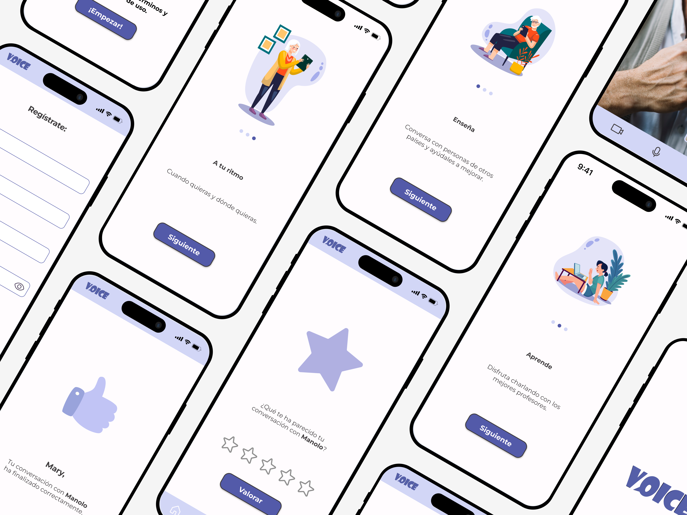

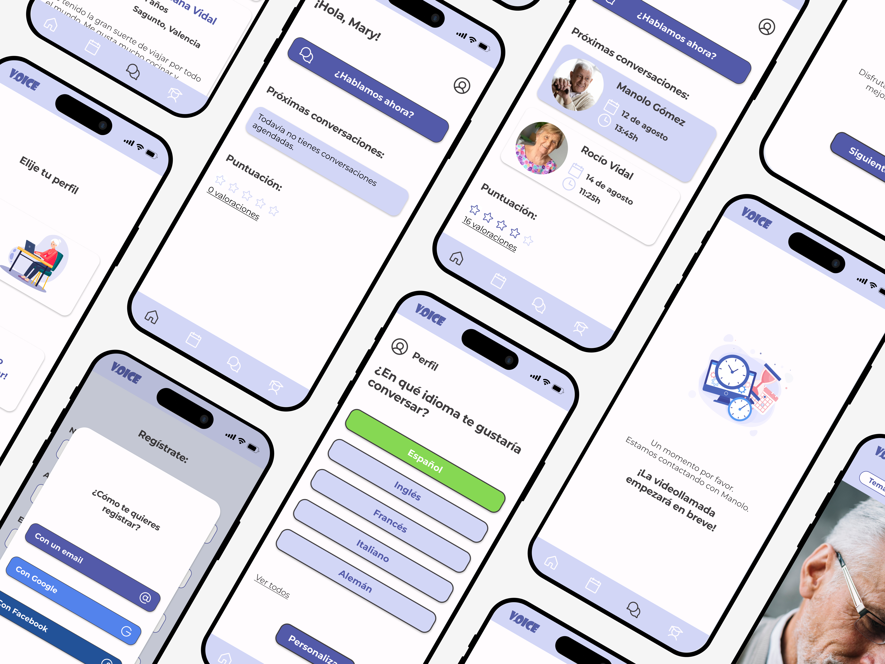

# Final thoughts and future iterations

This project holds a special place in my heart as it was my first UX project, but with the knowledge I’ve gained since, I now see ways to make it even better. More than anything, this experience showed me how important it is to really understand your users—especially when designing for older adults who may not be familiar with technology.

If I were to revisit this project today, I’d focus on the following updates:

- **Enhancing contrast** further—even though it currently passes the contrast test—to create an even more accessible experience for users with visual impairments.
- **Simplifying the copy** to make it clearer and more engaging.
- **Improving spacing and layout consistency** to achieve a cleaner and more polished design.
- **Increasing font sizes** to better meet the needs of older users.
- **Redesigning icons and lines** for greater clarity and cohesion.

Voice was an important project that shaped how I think about accessibility and user-focused design, and it remains a big step in my UX journey.