# Vurger

Role: UX researcher UI designer
Team: I was responsible for the entire process from research to prototyping
Tags: Case Study, KDS, POS, UI/UX
Tools: Figjam, Figma, Useberry

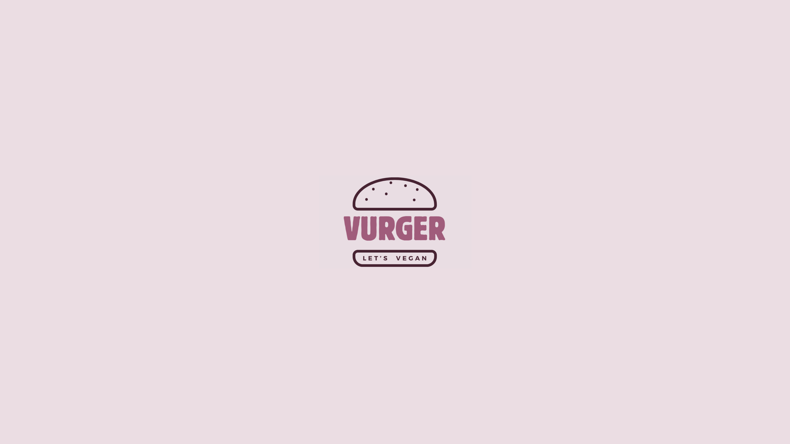

# A quick look

Vurger is a design challenge focused on creating an internal tool to manage orders in a vegan fast-food restaurant. The goal was to improve the in-store experience by letting customers order from their phones using a **Point of Sale (POS)** system, without waiting in line. 

Once an order is placed, the system assigns it to an available staff member and sends the details directly to their **Kitchen Display System (KDS)**. 

This reduces waiting times, improves communication, and makes the overall process smoother for everyone.

<aside>
👉

Click to explore deeply

🧠 [Full UX process in FigJam →](https://www.figma.com/board/7xRFBMHEQLsxOROE6Gmvj1/Planificaci%C3%B3n-y-research?node-id=0-1&t=a5FoD5g0TrBUuAze-1)

🎨 [Full UI process in Figma →](https://www.figma.com/design/1Rn1kkZCf1EfofKIZHjkvP/Dise%C3%B1o-y-prototipos?node-id=3-5&t=Ii3XxQwq4QxcrvJc-1) 

</aside>

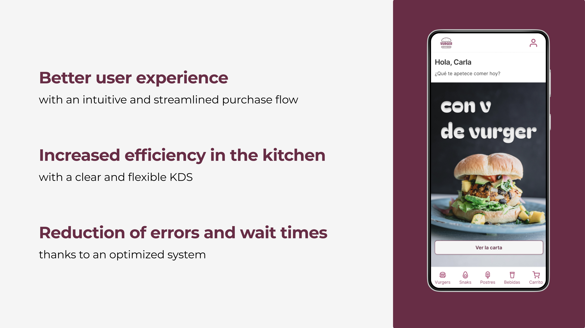

# The Challenge

**How might we reduce friction in the ordering process for both customers and restaurant staff, while keeping the flow fast, friendly, and sustainable?**

A streamlined design solution for a smooth and efficient order management experience at Vurger, a vegan fast-food burger restaurant.

# Process

<aside>
👉

Click to jump to the corresponding section

[Desk Reserch and Hypothesis →](https://app.notion.com/p/Vurger-1e6bd7a9feb8803aa138f43a544a9cb6?pvs=21) 

[Interviews and Benchmarking →](https://app.notion.com/p/Vurger-1e6bd7a9feb8803aa138f43a544a9cb6?pvs=21)

[Personas and Costumer Journeys →](https://app.notion.com/p/Vurger-1e6bd7a9feb8803aa138f43a544a9cb6?pvs=21)

[MPV Definition →](https://app.notion.com/p/Vurger-1e6bd7a9feb8803aa138f43a544a9cb6?pvs=21)

[Prototyping and Testing →](https://app.notion.com/p/Vurger-1e6bd7a9feb8803aa138f43a544a9cb6?pvs=21)

</aside>

## Desk Reserch and Hypothesis

I started by researching trends in self-ordering and restaurant workflows. I also looked into **queueing theory** to understand how to reduce wait times and improve order flow.

Based on this, I defined the first hypothesis:

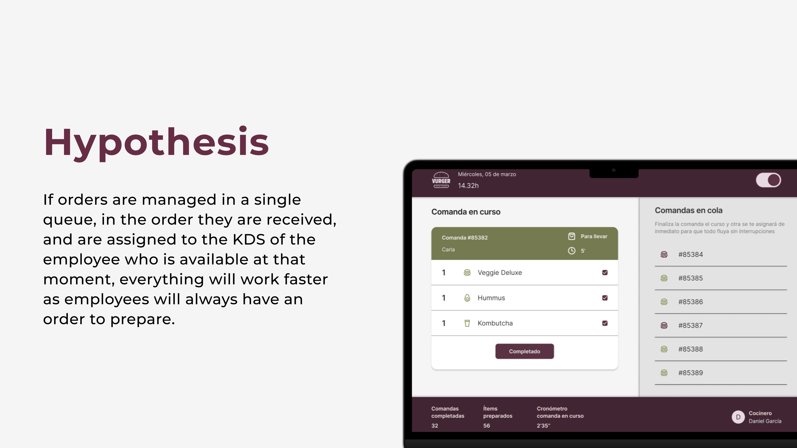

## Interviews and Benchmarking

I did an interview with the **manager of a fast-food restaurant** (Miss Sushi, Heron City – Valencia) to better understand how the staff works, what tools they use, and what problems they face during busy hours.

I also **explored existing KDS** (Kitchen Display Systems) **and POS** (Point of Sale) tools to see what works well and where there is room for improvement.

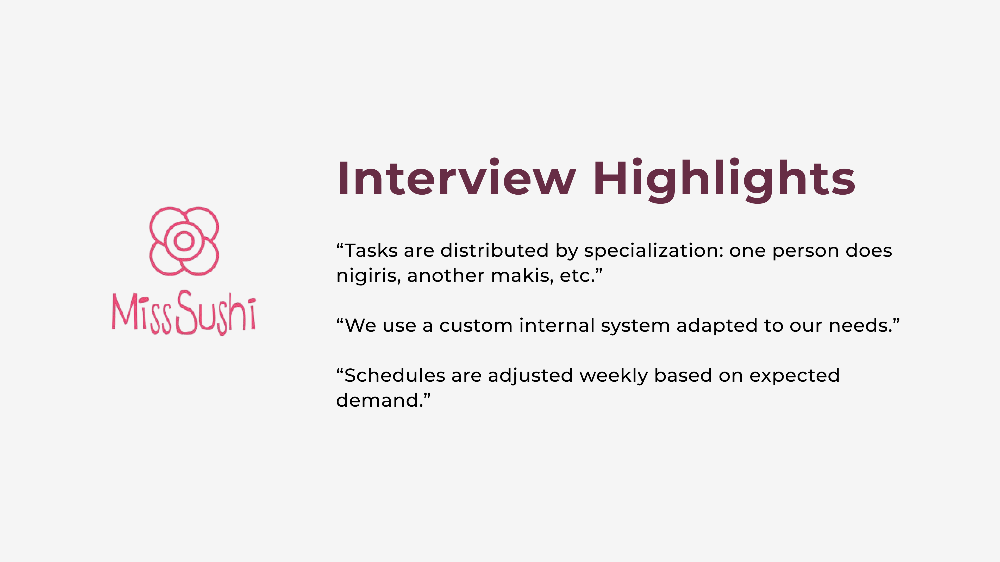

## Personas and Customer Journeys

I created personas and customer journeys to **map key moments in the experience**. This helped me find more opportunities to improve and simplify the flow.

I then prioritized the **insights** I found to define a **Minimum Viable Product (MVP)** that focused on solving the most important needs first.

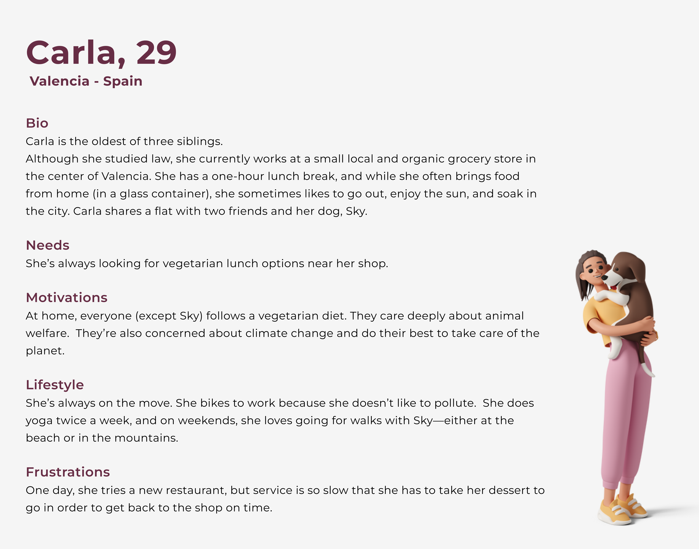

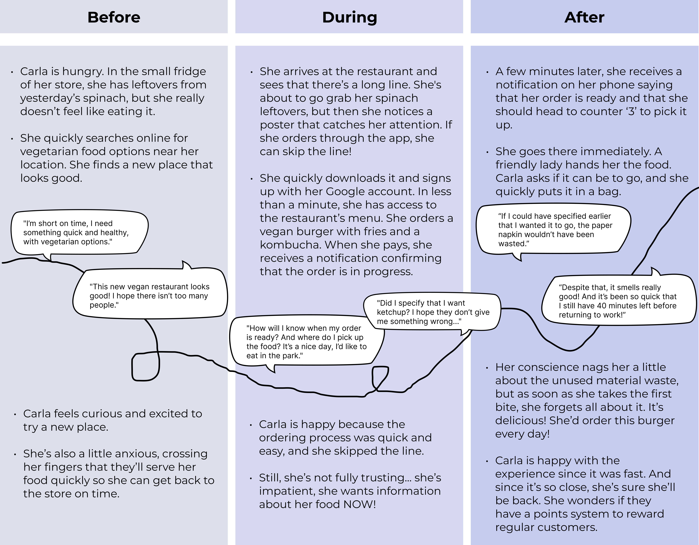

- **Insights**
    - There could be information about the number of people in the queue and the approximate waiting time.
    - Carla could start her order from her store, and be notified when it’s ready so she can go pick it up.
    - Ensure users are aware of the ordering process before arriving at the location.
    - Notify and confirm the order status at every step.
    - Allow users to review and edit their order before proceeding to payment.
    - Provide a quick and easy login and payment system.
    - Allow users to specify if the order is for dine-in or takeout.
    - Add a loyalty program and an option to save favorite orders.
    - Display personalized ingredient suggestions based on allergies, preferences, or previous purchases.

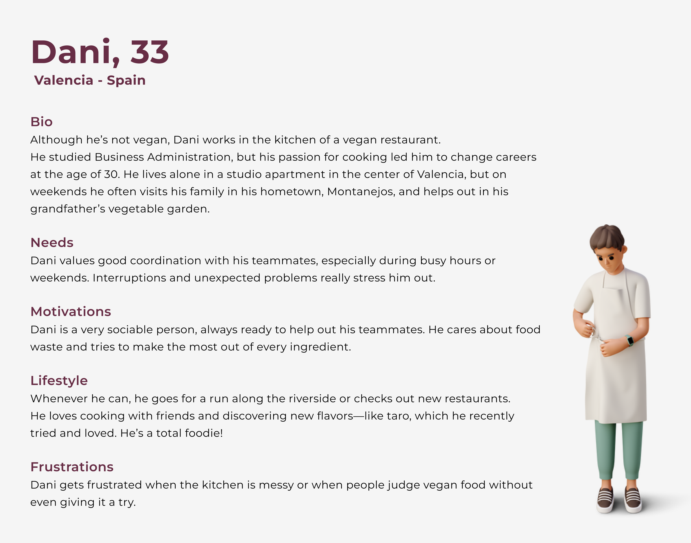

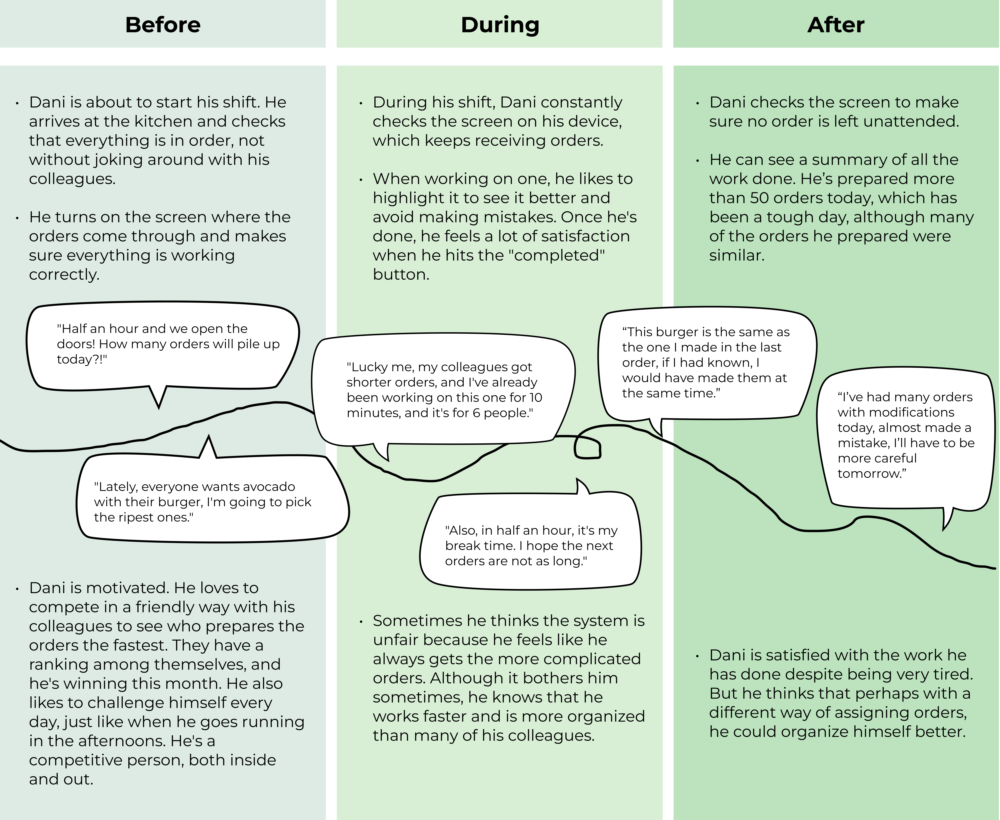

- **Insights**
    - The possibility to track completed orders or implement a gamification system to make the work more entertaining and maintain the motivation of the kitchen staff.
    - Notifications when some ingredients are about to run out.
    - Expand or highlight the current order to view it clearly.
    - Mark completed items for each order (so satisfaction comes not only from completing the whole order but also from finishing each product), and avoid errors.
    - Track not only completed orders but also prepared items (taking into account the type of item).
    - The system should assign orders fairly and equitably, considering the work pace of each employee.
    - The system should account for break and rest times when assigning orders.
    - If there are multiple orders with the same product, group them to optimize preparation time.
    - The ability to compare the metrics of the orders completed in the last few days to compare performance, see improvements, and track progress (motivation and adherence, like Strava).
    - Highlight modifications clearly.

## MVP Definition

I used prioritization matrices to define an MVP that **focused on the most important features**. After that, I created **early sketches, wireframes, and user flows** for both customers and staff.

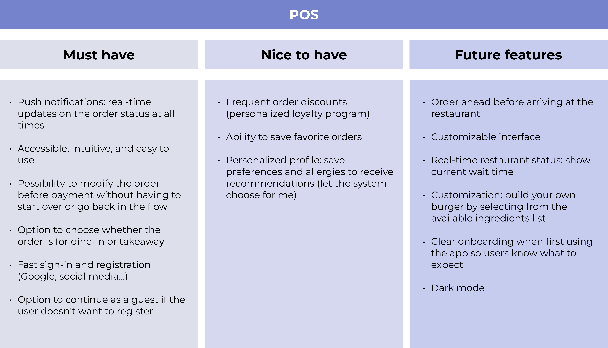

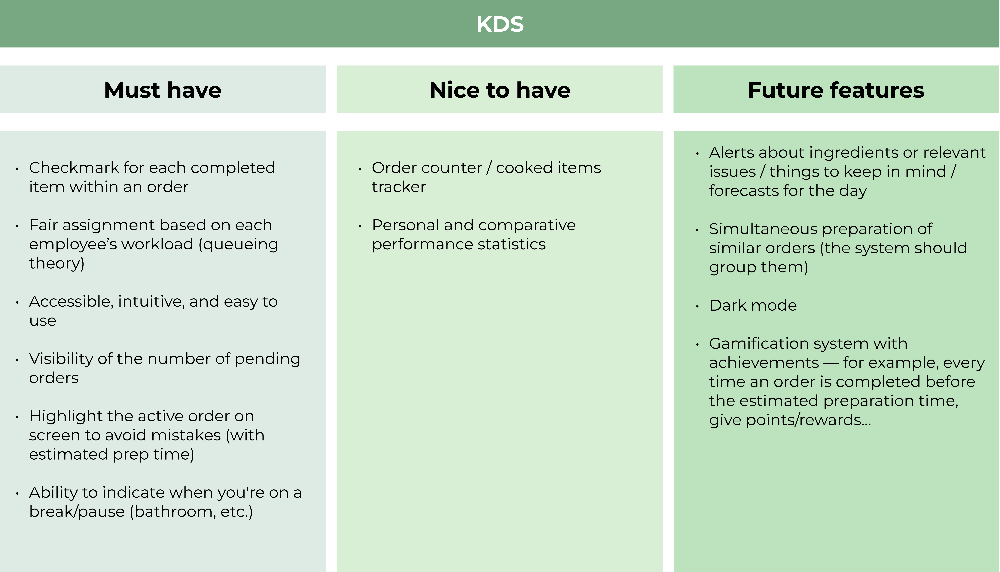

## Prototyping and Testing

I built **interactive prototypes:**

<aside>
📱

[POS Prototype (Figma) →](https://www.figma.com/proto/1Rn1kkZCf1EfofKIZHjkvP/Dise%C3%B1o-y-prototipos?page-id=3080%3A2429&node-id=3732-10857&viewport=283%2C-144%2C0.1&t=c27rWqfGYjVQoaiG-1&scaling=scale-down&content-scaling=fixed&starting-point-node-id=3080%3A3776)

</aside>

<aside>
🍳

[KDS Prototype (Figma) →](https://www.figma.com/proto/1Rn1kkZCf1EfofKIZHjkvP/Dise%C3%B1o-y-prototipos?page-id=3135%3A1673&node-id=3640-8160&viewport=235%2C312%2C0.19&t=j360dKErUX1A2f5G-1&scaling=scale-down&content-scaling=fixed&starting-point-node-id=3640%3A8160)

</aside>

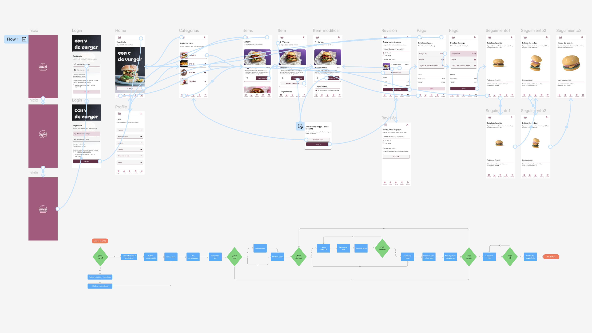

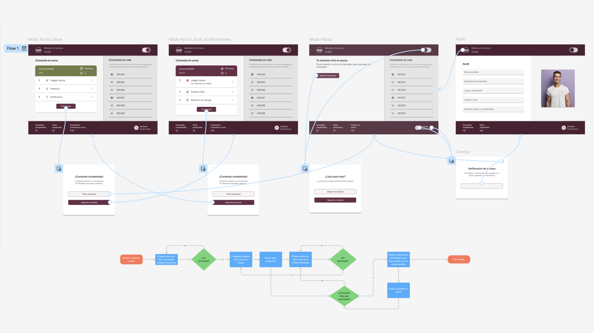

I **tested the POS** with users to gather initial feedback. Based on the results, there are some **iterations** that I will implement to improve clarity and usability.

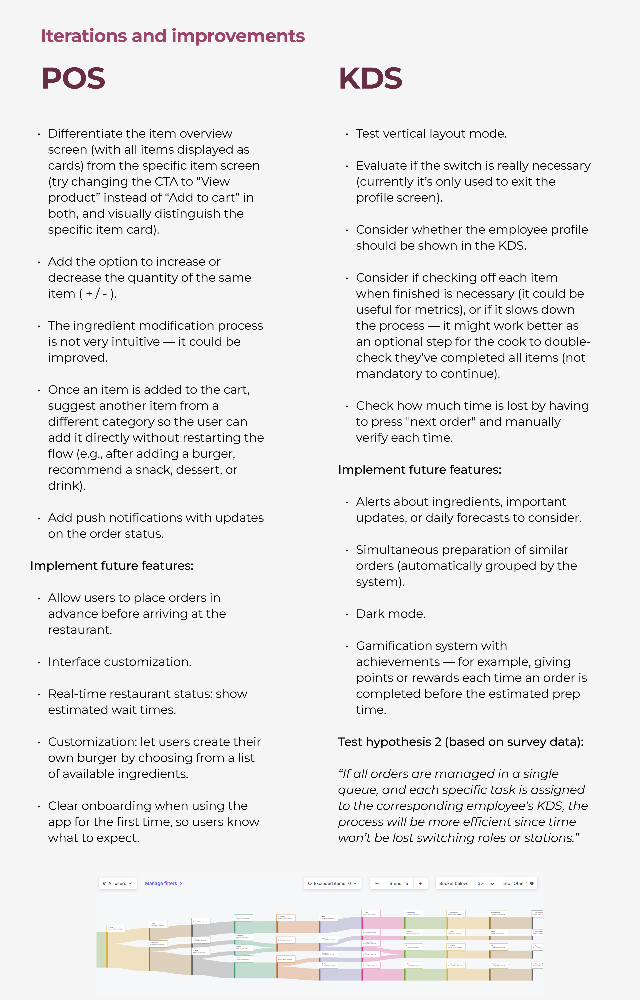

# Final thoughts

This challenge helped me learn more about **KDS and POS systems**, which were quite new to me—especially the KDS.

I’ve already worked with **agile methodologies** before, but doing this as a solo design sprint made me realize even more how important those methods are for creating good design processes. Following the steps, iterating, and improving ideas little by little was key.

One thing **I really missed was working as part of a team**. Sharing ideas, getting feedback, and solving problems together is something that always adds a lot of value, and I felt its absence during this project.

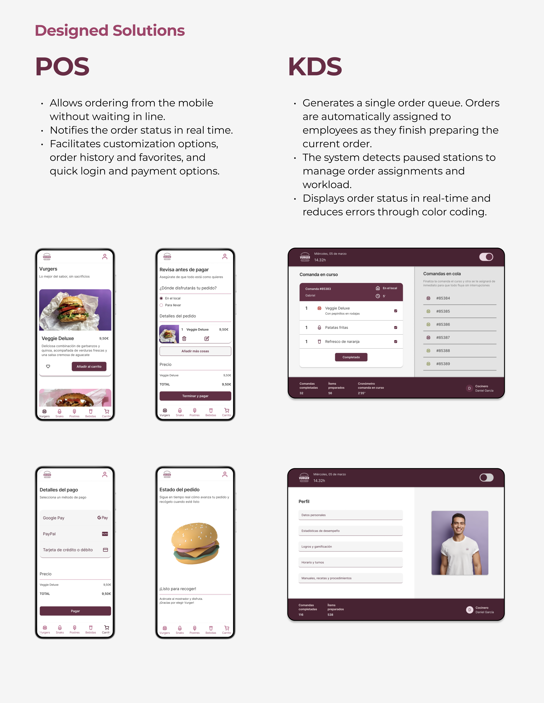

Finally, if you’d like to take a closer look at the process and prototypes:

🧠 [Full UX process in FigJam →](https://www.figma.com/board/7xRFBMHEQLsxOROE6Gmvj1/Planificaci%C3%B3n-y-research?node-id=0-1&t=a5FoD5g0TrBUuAze-1)

🎨 [Full UI process in Figma →](https://www.figma.com/design/1Rn1kkZCf1EfofKIZHjkvP/Dise%C3%B1o-y-prototipos?node-id=3-5&t=Ii3XxQwq4QxcrvJc-1)